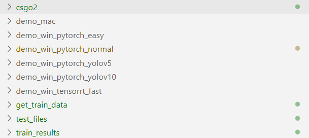
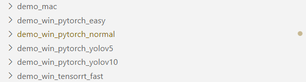
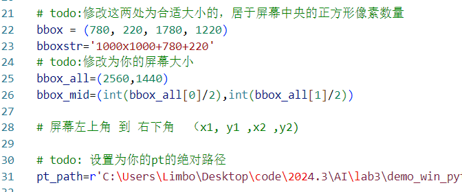
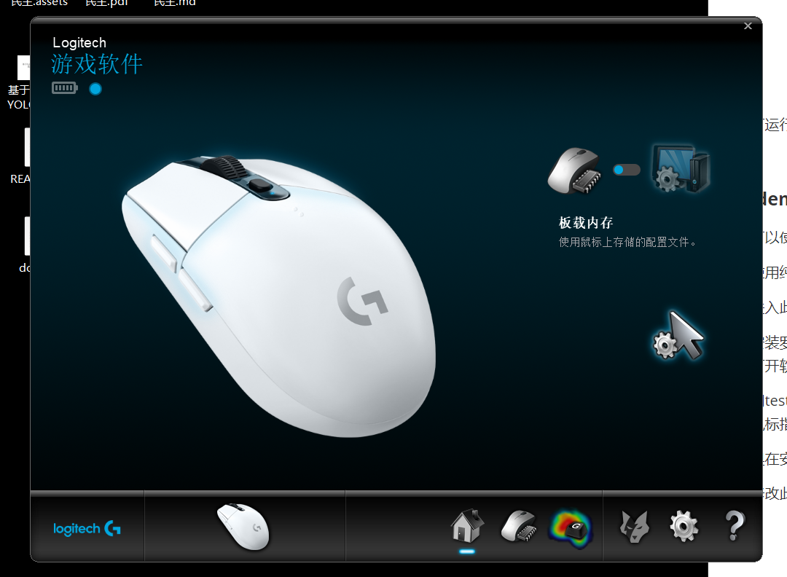
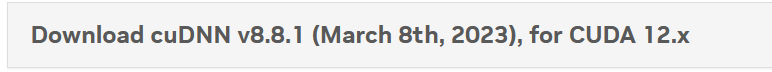
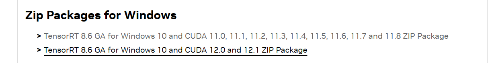
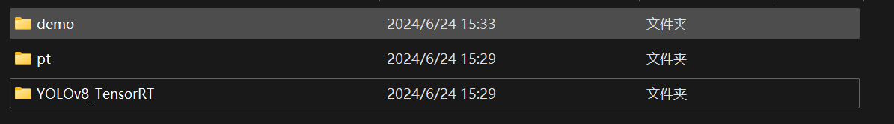
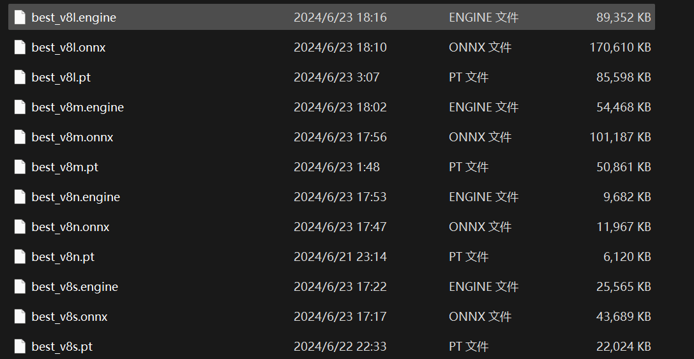

# 基于Python, YOLO模型, TensorRT的高性能CSGO2自瞄外挂


代码是一点一点手搓的，没有参考任何已有的项目。

**您可以查看从demo1到demo5的不同版本之间的变化**


## 1. 项目结构




csgo2文件夹中是我自建的数据集

train_results 包含了我训练过的所有模型的训练结果

**demo_win_pytorch_normal 包含了我的大部分工作相关的代码**，其中包含了我**逐步开发的5个版本**，并在代码中有简要说明。其中**demo4.py是完全可运行的**

get_train_data是我用来在游戏中截图，并分割数据集的代码

test_files 中包括了一些可以帮助您检测环境是否安装完成的代码


## 2. 如何跑通代码？

如果你想尝试更高的性能，就需要配置更多的东西。

我提供了以下几个版本：



demo_mac是mac平台上的运行代码，我不清楚如何在mac上移动鼠标，所以您需要写一点代码才可以体验完整功能

 demo_win_pytorch_easy是win平台上的运行代码，只需要可以运行ultralytics的代码就可以使用全部功能，但速度一般

 demo_win_pytorch_normal 需要配置DXGI库和安装罗技驱动，可以取得很好的性能

 demo_win_tensorrt_fast 需要配置DXGI库和安装罗技驱动，进一步需要配置tensorrt可以取得最好的性能

demo_win_pytorch_yolov5 是 yolov5版本的代码，需要配置DXGI库和安装罗技驱动

demo_win_pytorch_yolov10 是 yolov10版本的代码，需要配置DXGI库和安装罗技驱动

以上，请您按需选择。如果在安装中遇到了问题，请提问。


#### 1.demo_mac

如果你想要在mac上运行，请使用此文件中的内容.

建议使用纯净的环境，

①参考官网配置好YOLOv8环境，确保torch、cuda、cudnn等的匹配

②进入此文件夹pip安装requirements.txt，

③修改此文件夹中demo4.py中的todo，例如



并添加移动鼠标的代码

即可运行。注意权重文件在demo_win_pytorch_normal中，我并没有复制两份


#### 2. demo_win_pytorch_easy

推荐使用这个版本。性能大概为25帧率还算够用，配置简单

建议使用纯净的环境，

①参考官网配置好YOLOv8环境，确保torch、cuda、cudnn等的匹配

②进入此文件夹pip安装requirements.txt，

③修改此文件夹中demo4.py中的todo，例如


即可运行。注意权重文件在demo_win_pytorch_normal中，我并没有复制两份


#### 3. demo_win_pytorch_normal

您可以使用test_files中的文件来测试环境是否安装成功

①使用纯净的环境，参考官网配置好YOLOv8环境

②进入此文件夹pip安装requirements.txt。

③卸载罗技鼠标驱动（如果有的话），并安装驱动*LGS_9.02.65_x64_Logitech.exe*，其大小大概为120MB，您可以在网上自行下载。

打开此软件，电脑重启后需要重新打开软件。



 软件页面如图。不显示这个白色鼠标是正常的，这是我的鼠标。。没有罗技鼠标也可以调用这个软件。

使用test_files中的logitech_test.py测试驱动是否安装成功，如果成功了应该在运行后看到鼠标指针移动。

如果在安装时遇到问题，可以参考网上相关安装教程以及我写的[罗技鼠标驱动卸载_罗技驱动卸载-CSDN博客](https://blog.csdn.net/2201_75408623/article/details/139034172?spm=1001.2014.3001.5501)

④修改此文件夹中demo4.py中的todo，例如


即可运行。


#### 4. demo_win_pytorch_yolov5

①使用纯净的环境，参考官网配置好YOLOv5环境

②进入此文件夹,   pip安装requirements.txt。

③卸载罗技鼠标驱动（如果有的话），并安装此驱动*LGS_9.02.65_x64_Logitech.exe*，并打开此软件。电脑重启后需要重新打开软件。

④修改此文件夹中demo4.py  时间原因我没有写todo，看着改就可以了


#### 5.demo_win_pytorch_yolov10

①使用纯净的环境，参考官网配置好YOLOv10环境

②进入此文件夹pip安装requirements.txt。

③卸载罗技鼠标驱动（如果有的话），并安装此驱动*LGS_9.02.65_x64_Logitech.exe*，并打开此软件。电脑重启后需要重新打开软件。

④修改此文件夹中demo4.py  时间原因我没有写todo，看着改就可以了


#### 6.demo_win_tensorrt_fast

强烈建议您使用与我完全一致的版本！我使用的环境是：

nvidia驱动支持的最高版本：CUDA Version: 12.3（命令行输入nvidim-smi可查看）

cuda安装版本：12.1

python版本：3.9.19

torch版本：

````
pip install torch==2.2.0 torchvision==0.17.0 torchaudio==2.2.0 --index-url https://download.pytorch.org/whl/cu121
````

cudnn版本：



[cuDNN Archive | NVIDIA Developer](https://developer.nvidia.com/rdp/cudnn-archive)

tensorRT版本：



[NVIDIA TensorRT 8.x Download | NVIDIA Developer](https://developer.nvidia.com/nvidia-tensorrt-8x-download)

以上相关环境的安装可以参考网上的教程，但建议保持您安装的版本与我的一致


然后请参考此连接配置yolov8-tensorrt环境：

[yolov8实战第三天——yolov8TensorRT部署（python推理）（保姆教学）_yolov8 tensorrt python-CSDN博客](https://blog.csdn.net/qq_34717531/article/details/135022392)


确保罗技驱动与所有代码用到的库都安装完成后，导出pt文件为onnx文件，再导出为engine文件，engine文件是此处demo4.py的模型参数。

拷贝demo_win_tensorrt_fast文件夹与YOLOv8_tensorrt处于同一目录下，如下。



我导出的engine文件放在了pt文件夹下，由于每个电脑上都不一样，所以我没有上传。大致的文件结构如图：



略微修改此文件夹中demo4.py中的todo，即可运行.


## 3.代码技术细节

参考doc.pdf